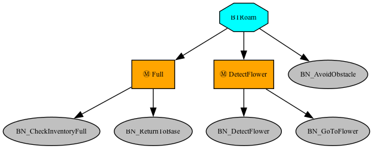
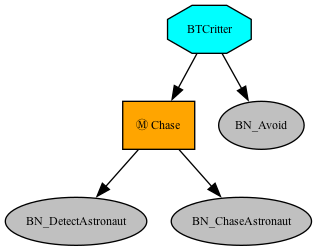
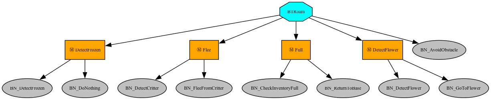

# AAPE Behaviour Trees

Behaviour tree-based autonomous agents for the AAPE (Autonomous Agents Programming Environment) simulation. Agents (astronauts and critters) navigate a 3D environment, collect resources, and interact with each other using behaviour trees built with [py_trees](https://py-trees.readthedocs.io/).

## Scenarios

### 🧑‍🚀🌹 Alone
A single astronaut roams the map collecting AlienFlowers and returning them to base. The behaviour tree prioritises:
1. **Full inventory** — return to base and unload when carrying 2+ flowers
2. **Flower detection** — approach and collect detected flowers
3. **Obstacle avoidance** — roam while avoiding obstacles (ignoring flowers)



### 👾 Critters
Critter agents (CritterMantaRay) roam the environment chasing astronauts. The behaviour tree prioritises:
1. **Chase** — detect and pursue nearby astronauts, then move away after reaching them
2. **Roam (BN_Avoid)** — avoid all obstacles (including flowers) with random exploration



### 🌹🏃‍♀️👾 Collect-and-Run
Extends the Alone scenario with critter awareness. The behaviour tree prioritises:
1. **Frozen handling** — remain inactive while frozen by a critter hit
2. **Flee** — detect and run away from nearby critters
3. **Full inventory** — return to base (re-checks condition each tick in case flowers are lost)
4. **Flower detection** — collect flowers
5. **Obstacle avoidance** — default roaming behaviour



## Project Structure

```
AAPE/
├── AAgent_BT.py          # Main agent framework (WebSocket connection, state management)
├── BTRoam.py             # Astronaut behaviour tree (Alone & Collect-and-Run scenarios)
├── BTCritter.py          # Critter behaviour tree
├── Goals_BT_Basic.py     # All behaviour implementations (state machines)
├── Sensors.py            # Ray-cast sensor interface
├── Spawner.py            # Multi-agent launcher
├── AAgent-*.json         # Agent configuration files
└── APack*.json           # Multi-agent pack configurations
```

## Setup

### Requirements
- Python 3.8+
- AAPE simulation environment running locally

### Installation

Dependencies: `py-trees==2.4.0`, `aiohttp==3.13.3`

## Usage

1. Launch the AAPE simulation environment
2. Run a single agent:
   ```bash
   cd AAPE
   python AAgent_BT.py AAgent-Alpha.json
   ```
3. Or spawn multiple agents using a pack configuration:
   ```bash
   cd AAPE
   python Spawner.py APackAstroCritters.json
   ```

### Configuration Files

Each agent config (`AAgent-*.json`) specifies:
- **Server** — host and port for the WebSocket connection
- **AgentParameters** — agent type, team, spawn point, initial behaviour tree, and sensor parameters
- **Misc** — optional GUI monitor

Pack configs (`APack*.json`) define groups of agents to spawn together. For example, `APackAstroCritters.json` spawns 1 astronaut and 10 critters.

### Sensor Configuration

The `ray_perception_sensor_param` array: `[rays_per_direction, max_degrees, sphere_cast_radius, ray_length]`

Default: `[2, 45, 0, 5]` — 5 rays spanning 90 degrees with a range of 5 units.

## 👤 Authors

- Queralt Salvadó Hernández
- Yaira Brudenell Guedella
- Anna Blanco Illán
